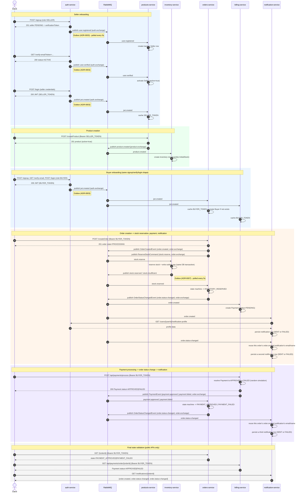

# Sequence diagram — end-to-end business flow

Companion to [`docs/walkthrough.md`](walkthrough.md): the same flow (signup
through order, stock reservation, payment, and notification), as a Mermaid
sequence diagram. Every message shown here has a corresponding `curl` call
and expected response in the walkthrough — use that document to actually
run the flow; use this one to see the shape of it at a glance. For the
higher-level map (bounded contexts, persistence, the full exchange/event
table), see [docs/architecture/overview.md](architecture/overview.md).

RabbitMQ is drawn as its own participant (not a direct service-to-service
arrow) because that's what's actually happening: every cross-service event
in this system is an async publish/consume through a topic exchange, never
a direct call. The `Outbox (ADR-000x)` notes mark the only two services
(`auth-service`, `inventory-service`) where the publish itself is
asynchronous relative to the write that triggered it (a background poller,
not an in-request publish) — everywhere else, the publish happens
synchronously inside the same request that produced it ("write-then-publish",
best-effort, no outbox).

## Reading notes

- **`jwt.created` is bound to three queues** (products-service,
  orders-service, billing-service), each independent — this is the same
  pattern ADR-0001 fixed after finding two consumers competing on one
  shared queue. `auth-service` is the producer only; it never consumes its
  own broadcast (see
  [`docs/adr/0015-billing-service-jwt-and-auth-securityconfig-fix.md`](adr/0015-billing-service-jwt-and-auth-securityconfig-fix.md)).
  `products-service`'s consumer (`UserEventConsumer.handleJwtCreated`)
  only caches the token when the event's role is `SELLER` — a `BUYER`'s
  `jwt.created` event reaches that queue but is logged and ignored, which
  is why the buyer flow above shows only `orders-service`/`billing-service`
  caching it. `orders-service` and `billing-service`'s consumers cache
  unconditionally, regardless of role.
- **`user.registered`/`user.verified` are also bound in `orders-service`**
  (`UserEventsConsumer`), not just `products-service` — this diagram omits
  those arrows in the seller-onboarding block because they have no
  observable effect on the documented flow (orders-service creates/activates
  its own generic `Buyer` row for the seller's user id too, which nothing
  in this walkthrough ever reads back), but they do fire. The event flow
  summary table in [`docs/walkthrough.md`](walkthrough.md) lists both
  consumers for accuracy even where this diagram simplifies.
- **`order.created` fans out to two consumers** (billing-service,
  notification-service), independent of the `stock.reserve` /
  `stock.reserved` round trip with inventory-service — a payment is created
  and a notification is persisted regardless of whether stock reservation
  later succeeds or fails. This is a deliberate current gap, not modeled as
  a fix here: `orders-service` does not currently compensate/cancel the
  `Payment` if the order later transitions to `INVENTORY_FAILED`.
- **Outbox pattern applies to exactly two services**, not universally:
  `auth-service` (ADR-0003) and `inventory-service` (ADR-0007). Everywhere
  else in this diagram (products-service, orders-service, billing-service),
  the publish is a direct, in-request, best-effort call — no transactional
  guarantee that the write and the publish both succeed or both fail
  together.
- **notification-service's call to `auth-service` is the one synchronous,
  direct HTTP call in this entire flow** — everything else crosses
  services exclusively through RabbitMQ. See
  [`docs/adr/0014-notification-service.md`](adr/0014-notification-service.md).
- **`order.status-changed` is consumed the same way `order.created` is**
  (its destination was decided in
  [`docs/adr/0001-messaging-wiring-audit.md`](adr/0001-messaging-wiring-audit.md)'s
  Update, implemented here), but it carries no `userId` of its own — unlike
  `OrderCreatedEvent`. `notification-service` resolves this by reusing the
  email/name already captured in that same order's `order.created`
  notification row (its own schema, no second synchronous call, no
  cross-schema access) rather than calling `auth-service` a second time. A
  status change never replaces an earlier notification — every event
  produces its own new row, so an order can have any number of
  notifications over its lifetime, oldest first.
- `notification-service`'s notification message content is implemented
  directly in code, not as an externalized template — deliberately, to
  keep this stage simple and readable rather than runtime-configurable.
- **The payment outcome closes the loop the same way the stock outcome
  does**: `billing-service`'s `POST /api/payments/process`
  (`PaymentService.processPayment`, a random 90%-approval simulation)
  now publishes `payment.approved`/`payment.failed` once it resolves,
  and `orders-service`'s `PaymentEventsConsumer` reacts by calling
  `OrderService.handlePaymentReceived`/`handlePaymentFailed` — the same
  state-machine methods that existed before this diagram's payment block
  was added, previously unreachable (removed as dead, incorrectly-typed
  code in [ADR-0001](adr/0001-messaging-wiring-audit.md), finding 5;
  wired up correctly here). `notification-service` required zero changes
  to react to the resulting `order.status-changed` — it already consumes
  that routing key regardless of which service's state transition
  produced it. `POST /api/payments/{orderId}/retry` (resets a `FAILED`
  payment back to `PENDING`) is not part of the documented flow and still
  doesn't appear in this diagram.
